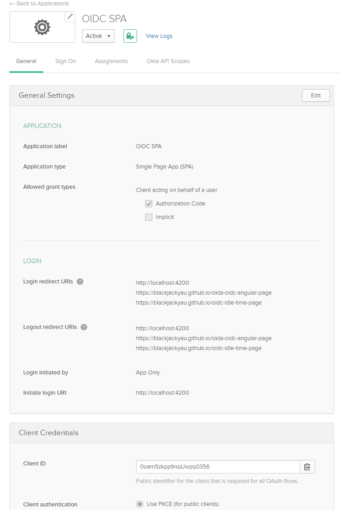
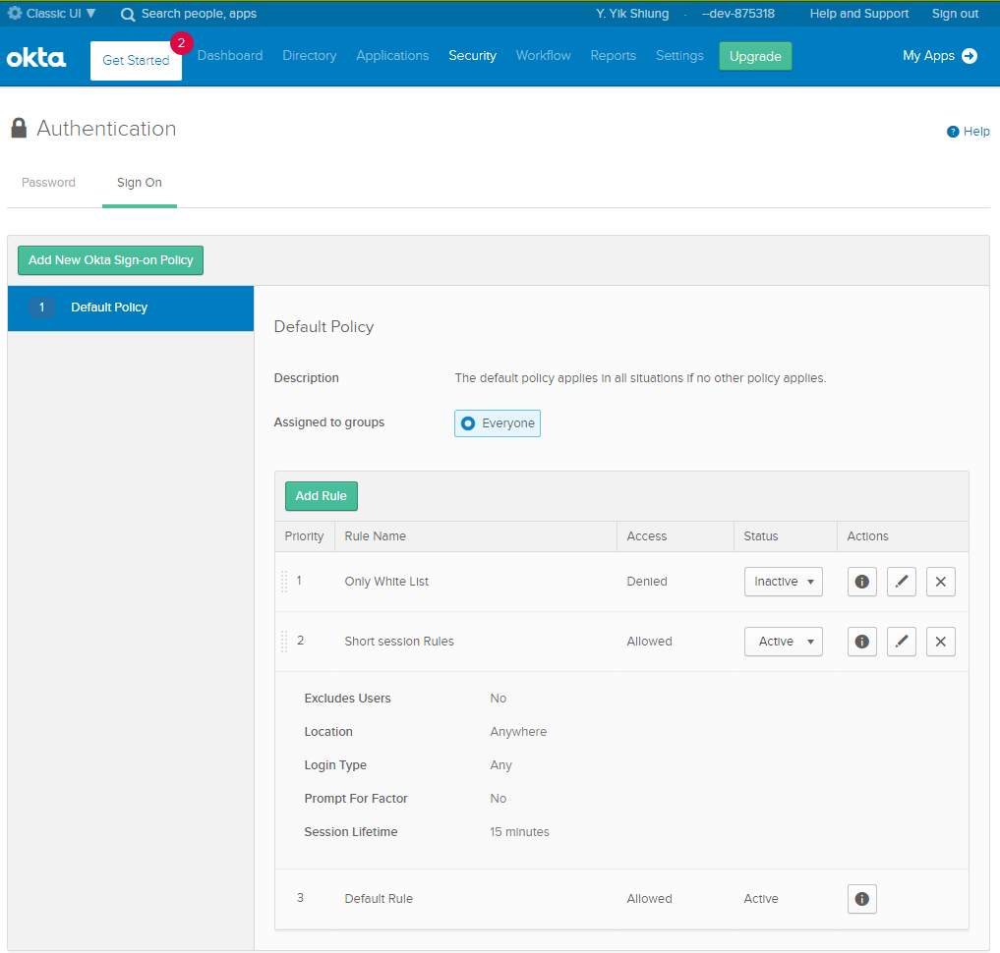
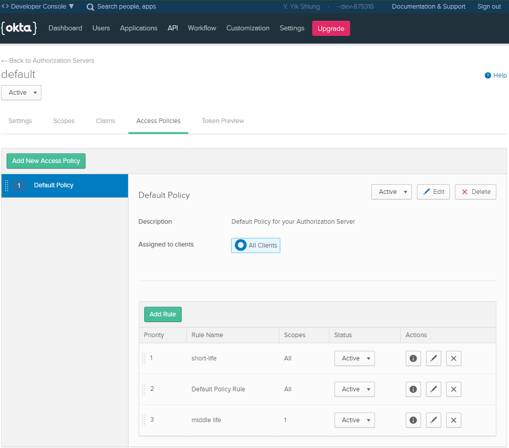

# Oidc Idle Time Implementation using Okta and Angular
This project is a sample implementation of OIDC Idle Time handling described from [here](https://medium.com/@yau.yik.shiung/oidc-idle-timeout-design-5149da2be93e) in Angular project.

[Github Page (hosted)](https://blackjackyau.github.io/oidc-idle-time-page)

## Project setup
1. OP (OpenID Provider) / IdP = [OKTA](https://dev-875318.okta.com)
2. RP (Relying Party) = [dummy.restapiexample.com](http://dummy.restapiexample.com)
3. IdP session extention API [Session Me](https://developer.okta.com/docs/reference/api/sessions/#get-current-session)

## Project Walkthrough
1. Login using `sample@example.com` | `Password123`
2. Open and observe browser developer console
3. `IdP session extended for 15 minutes` indicates OP/IdP Session TTL has been extended to 15 minutes more
4. `Access token renewed (15 minutes)` indicates Access Token for RP has been renewed (also indicating IdP session is still active)
5. Simulate the "user active" activity using RP API call (Reload button), Refers to the blog for the handling details 

## Okta IdP Setting
Register your okta developer account (https://developer.okta.com/signup)

### Application Setting

### IdP SSO TTL Setting

### RP Access Token Expiration Setup

### workbox integration [link](https://developers.google.com/web/tools/workbox/guides/get-started)
#### npm bundle way and workbox-config configuration way
[Reference](https://developers.google.com/web/tools/workbox/guides/codelabs/npm-script)
1. in package.json, generate service worker metadata `"build-sw-config": "ng build --prod=true && workbox generateSW"`
2. workbox will look for the workbox-config and generate the precached assets
3. generate a sw.js (specify from config) and register at window service worker (main.ts)
4. to run `npm run build-sw-config && npm run server`

#### Achieve custom service worker js
[Reference](https://codelabs.developers.google.com/codelabs/workbox-lab/#0)
1. achieve precahce using inject manifest `"build-sw-script": "ng build --prod=true && workbox injectManifest"`
2. support both CDN and local [link](https://developers.google.com/web/tools/workbox/modules/workbox-sw#using_local_workbox_files_instead_of_cdn)
3. of course the best option is still be local mode
4. to run `npm run build-sw-script && npm run server`